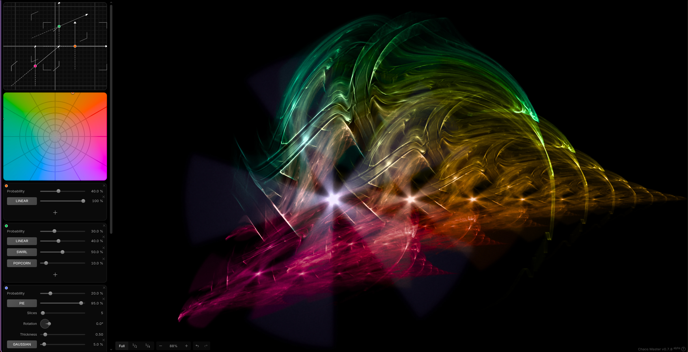

[](https://github.com/chaos-matters/chaos-master/actions/workflows/node.js.yml)
[](https://ko-fi.com/chaosmatters)
[](https://github.com/sponsors/chaos-matters)

# Chaos Master


WebGPU based IFS Flame Generator for Artists and Explorers. High-performance, real-time fractal generation using modern web standards.

[**Launch Chaos Master**](https://chaos-master.com)

## Gallery

<!-- IMAGE_PLACEHOLDER_START -->

<!-- IMAGE_PLACEHOLDER_END -->

## Development

### Prerequisites
- **Node.js** `^22.0.0`
- **pnpm** `^10.0.0`
- **Browser** WebGPU-enabled (Chrome 113+, Edge 113+, or Safari 17+)

### Build & Run
```bash
# Install dependencies
pnpm install

# Start local development server
pnpm start

# Build for production
pnpm build

```

## Features
- **WebGPU Rendering**: Real-time IFS fractal evaluation.
- **Affine Editor**: Interactive transformation manipulation.
- **Metadata-rich Exports**: PNGs with embedded flame state for easy sharing.
- **Theme Support**: Adaptive dark/light interfaces.
