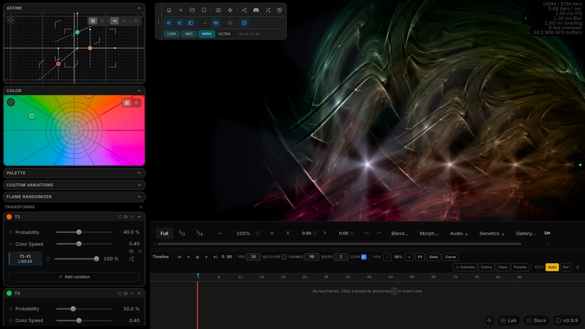
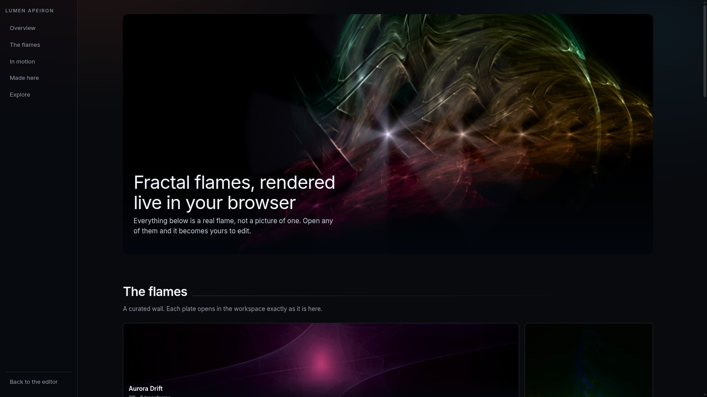

<p align="center">
  
</p>

<h1 align="center">Lumen Apeiron</h1>

<p align="center">
  An open-source WebGPU studio for creating IFS fractal flames in your browser.<br />
  Shape them live, animate them, make them react to sound, evolve new forms, and share the result.
</p>

<p align="center">
  <a href="https://lumenapeiron.com/"><strong>Launch the app</strong></a>
  ·
  <a href="https://about.lumenapeiron.com/">Explore the website</a>
  ·
  <a href="https://lumenapeiron.com/#home">Visit Home</a>
  ·
  <a href="https://lumenapeiron.com/discord">Join Discord</a>
</p>

<a href="https://lumenapeiron.com/">
  
</a>

For generative artists, motion designers, creative coders, and curious explorers. Lumen Apeiron turns the fractal flame into a responsive creative material—not only a final render.

## What you can make

- **Live 2D and 3D flames** — shape transforms, variations, symmetry, palettes, color, and cameras around a real-time WebGPU render.
- **Fractal foundations** — open exact Sierpiński, Koch, Barnsley, Heighway, Cantor, and Menger constructions as editable flame descriptors.
- **Generative discoveries** — explore a curated live Home, then randomize, mutate, blend, and morph any flame into your own.
- **Evolving families** — breed flames, run populations, compare structural differences, and trace ancestry.
- **Animation and motion** — keyframe render, camera, transform, variation, and color controls across a timeline, dope sheet, curves, loops, and video exports.
- **Sound in both directions** — map music or a live microphone to flame parameters, or turn a flame's structure into sound with sonification.
- **Your own mathematics** — author custom variations in WGSL or plain math, browse built-in documentation, and create or import palettes.
- **Portable work** — keep local recents, undo and redo freely, import common flame formats, and export PNGs carrying their editable flame state.
- **Tools for exploration** — guided tours, share links, a logo and favicon generator, and a dedicated Benchmark Studio.
- **An AI at the controls** — WebMCP tools let an agent drive the editor and the Lumen Arcade modes, recording every step as a replayable lesson. See [docs/webmcp.md](docs/webmcp.md).

## A gallery that is alive

<a href="https://lumenapeiron.com/#home">
  
</a>

Every piece on Home can become a live WebGPU render and opens directly in the editor with its flame—and animation, when present—ready to explore.

## Run it locally

Requires Node.js 22.12+, pnpm 10+, and a WebGPU-capable browser.

```bash
pnpm install
pnpm start
```

The app starts at `https://localhost:5173` (or the next available port).

<p align="center">
  <a href="https://github.com/chaos-matters/chaos-master/actions/workflows/node.js.yml">CI</a>
  ·
  <a href="LICENSE">AGPL-3.0</a>
  ·
  <a href="https://ko-fi.com/chaosmatters">Ko-fi</a>
  ·
  <a href="https://github.com/sponsors/chaos-matters">GitHub Sponsors</a>
</p>
